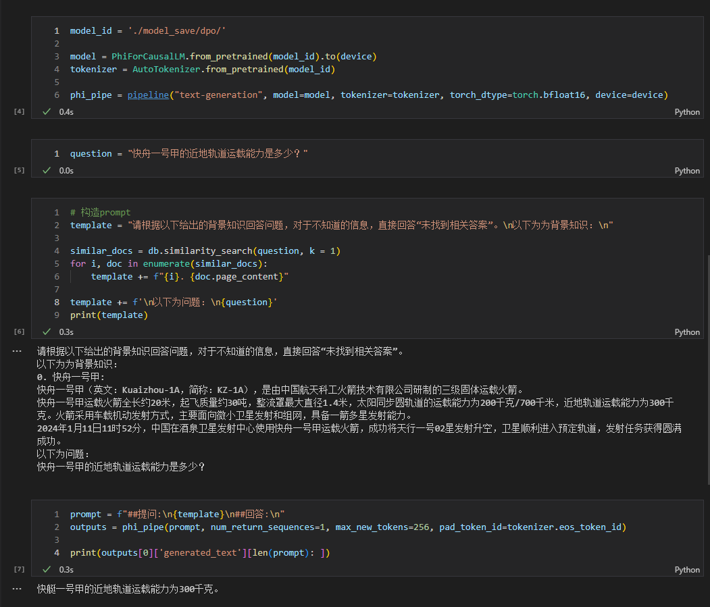

# Phi2-Chinese-0.2B 从0开始训练自己的Phi2中文小模型

**本项目为实验项目，开源代码及模型权重，预训练数据较少，如果需要效果更好的中文小模型，可以参考项目[ChatLM-mini-Chinese](https://github.com/charent/ChatLM-mini-Chinese)**

> [!CAUTION]
> 本项目为实验性项目，随时会大改，包括训练数据、模型结构、文件目录结构等。
> 第一版模型及请查看`tag v1.0`

- 支持flash attention 2 加速

# 1. ⚗️数据清洗
比如句末添加句号、繁体转简体、删除重复的标点符号（比如有些对话语料非常多`"。。。。。"`）、NFKC Unicode标准化（主要是全角转半角及网页数据的\u3000 \xa0问题）等等。   
具体的数据清洗过程请参考项目[ChatLM-mini-Chinese](https://github.com/charent/ChatLM-mini-Chinese)。  

# 2. 🗨️tokenizer训练 
本项目使用`byte level`的`BPE`分词器。共提供的两种分词器`char level` 和`byte level`的训练代码。  

训练完的tokenizer记得检查词表中是否有常见的特殊符号，如`\t`、`\n`等，可以尝试编一句包含特殊字符的文本`encode`、`decode`看看能不能还原。如果不包含这些特殊字符，通过`add_tokens`函数添加。使用`len(tokenizer)`获取词表大小，`tokenizer.vocab_size`不统计自己通过`add_tokens`函数添加的字符。     

tokenizer训练非常吃内存：  

- `byte level`训练1亿个字符至少需要`32G`内存（其实`32G`还是不太够，会频繁触发swap），`13600k`训练时长大概1个小时。   

- `char level`训练6.5亿个字符（刚好是中文wiki百科的数据量）至少需要32G内存，因为多次触发了swap，实际使用量远不止32G，`13600K`训练时长约半个小时。   

所以大数据集时（GB级别），建议训练`tokenizer`时从数据集中进行采样。  


# 3. ⛏️CLM因果模型预训练 

用大量文本进行无监督预训练，主要使用`bell open source`的数据集[BELLE](https://github.com/LianjiaTech/BELLE)。  

数据集格式：一个样本一句话，太长的可以截断分为多个样本。  

CLM预训练过程中，模型输入和输出是一样的，计算交叉熵损失的时候，要错开一位（`shift`）。  

处理百科语料时，建议在每个词条结束后加上`'[EOS]'`标记。其他语料处理也类似，一个`doc`的结束（可以时一篇文章结束或者段落结束）都要加上`'[EOS]'`标记。开始标记`'[BOS]'`可加可不加。


# 4. ⚒️SFT指令微调 

主要使用`bell open source`的数据集。感谢大佬[BELLE](https://github.com/LianjiaTech/BELLE)。  

SFT训练的数据格式如下：  
```python
text = f"##提问:\n{example['instruction']}\n##回答:\n{example['output'][EOS]"
```
模型计算损失时会忽略标记`"##回答:"`之前的部分（`"##回答:"`也会被忽略），从`"##回答:"`后面开始。

记得添加`EOS`句子结束特殊标记，否则模型`decode`的时候不知道要什么时候停下来。`BOS`句子开始标记可填可不填。


# 5. 📝RLHF优化

采用更简单、更节省显存的dpo偏好优化方法。  

根据个人喜好对SFT模型微调，数据集要构造三列`prompt`、`chosen`和 `rejected`，`rejected`这一列有部分数据我是从sft阶段初级模型（比如sft训练4个`epoch`，取0.5个`epoch`检查点的模型）生成，如果生成的`rejected`和`chosen`相似度在0.9以上，则不要这条数据。  

DPO过程中要有两个模型，一个是要训练的模型，一个是参考的模型，在加载的时候其实是同一个模型，只不过参考模型不参与参数更新。  


# 6. 📑本项目模型使用方法
## 6.1 普通对话能力
模型权重`huggingface`仓库：[Phi2-Chinese-0.2B](https://huggingface.co/charent/Phi2-Chinese-0.2B)  
```python
from transformers import AutoTokenizer, AutoModelForCausalLM, GenerationConfig
import torch

device = torch.device("cuda") if torch.cuda.is_available() else torch.device("cpu")

tokenizer = AutoTokenizer.from_pretrained('charent/Phi2-Chinese-0.2B')
model = AutoModelForCausalLM.from_pretrained('charent/Phi2-Chinese-0.2B').to(device)

txt = '感冒了要怎么办？'
prompt = f"##提问:\n{txt}\n##回答:\n"

# greedy search
gen_conf = GenerationConfig(
    num_beams=1,
    do_sample=False,
    max_length=320,
    max_new_tokens=256,
    no_repeat_ngram_size=4,
    eos_token_id=tokenizer.eos_token_id,
    pad_token_id=tokenizer.pad_token_id,
)

tokend = tokenizer.encode_plus(text=prompt)
input_ids, attention_mask = torch.LongTensor([tokend.input_ids]).to(device), \
    torch.LongTensor([tokend.attention_mask]).to(device)

outputs = model.generate(
    inputs=input_ids,
    attention_mask=attention_mask,
    generation_config=gen_conf,
)

outs = tokenizer.decode(outputs[0].cpu().numpy(), clean_up_tokenization_spaces=True, skip_special_tokens=True,)
print(outs)

```
```txt
##提问:
感冒了要怎么办？
##回答:
感冒是由病毒引起的，感冒一般由病毒引起，以下是一些常见感冒的方法：
- 洗手，特别是在接触其他人或物品后。
- 咳嗽或打喷嚏时用纸巾或手肘遮住口鼻。
- 用手触摸口鼻，特别是喉咙和鼻子。
- 如果咳嗽或打喷嚏，可以用纸巾或手绢来遮住口鼻，但要远离其他人。
- 如果你感冒了，最好不要触摸自己的眼睛、鼻子和嘴巴。
- 在感冒期间，最好保持充足的水分和休息，以缓解身体的疲劳。
- 如果您已经感冒了，可以喝一些温水或盐水来补充体液。
- 另外，如果感冒了，建议及时就医。
```

## 6.2 检索式生成（RAG）
具体代码见`rag_with_langchain.ipynb`




# 7、🎓引用
如果你觉得本项目对你有所帮助，欢迎引用。  
```conf
@misc{Charent2023,
    author={Charent Chen},
    title={A small Chinese causal language model with 0.2B parameters base on Phi2},
    year={2023},
    publisher = {GitHub},
    journal = {GitHub repository},
    howpublished = {\url{https://github.com/charent/Phi2-mini-Chinese}},
}
```

# 8、🤔其他事项
本项目不承担开源模型和代码导致的数据安全、舆情风险或发生任何模型被误导、滥用、传播、不当利用而产生的风险和责任。

